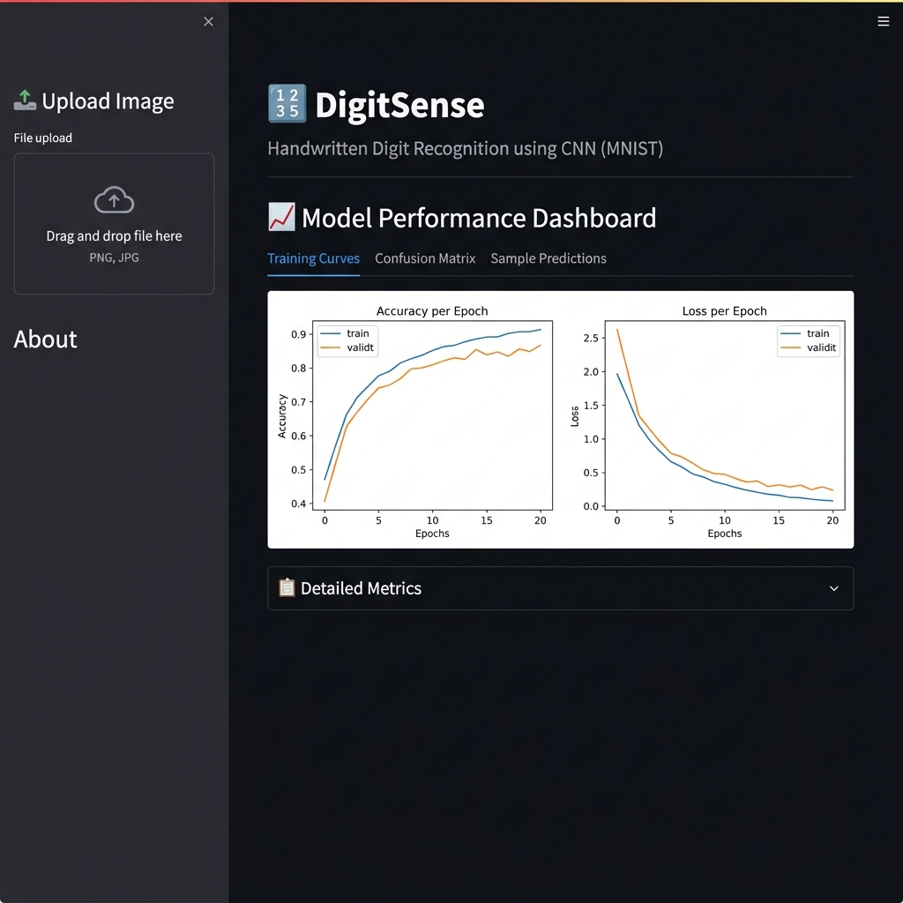

# DigitSense — Handwritten Digit Recognition using CNN

DigitSense is an end-to-end deep learning project that recognizes handwritten digits (0-9) using a Convolutional Neural Network (CNN) trained on the MNIST dataset.

## Setup Instructions

1. **Install dependencies:**
   ```bash
   pip install -r requirements.txt
   ```

2. **Train the model & generate results:**
   ```bash
   python src/train.py
   ```
   This will output the trained model to `model/digit_cnn.h5` and various analysis artifacts to the `results/` folder.

3. **Run the Streamlit Demo App:**
   ```bash
   streamlit run app.py
   ```
   Upload an image of a handwritten digit to test the model.

## Tech Stack
- **Framework:** TensorFlow / Keras
- **Web App:** Streamlit
- **Data Manipulation:** NumPy, Pillow
- **Metrics & Visualization:** Scikit-learn, Matplotlib, Seaborn

## Project Report
For a detailed analysis of model performance, architecture, and limitations, please read the full report: [DigitSense_Project_Report.md](report/DigitSense_Project_Report.md).

## App Screenshot


