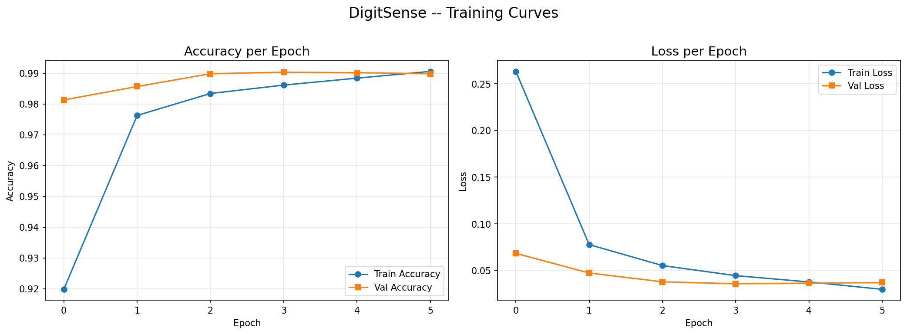
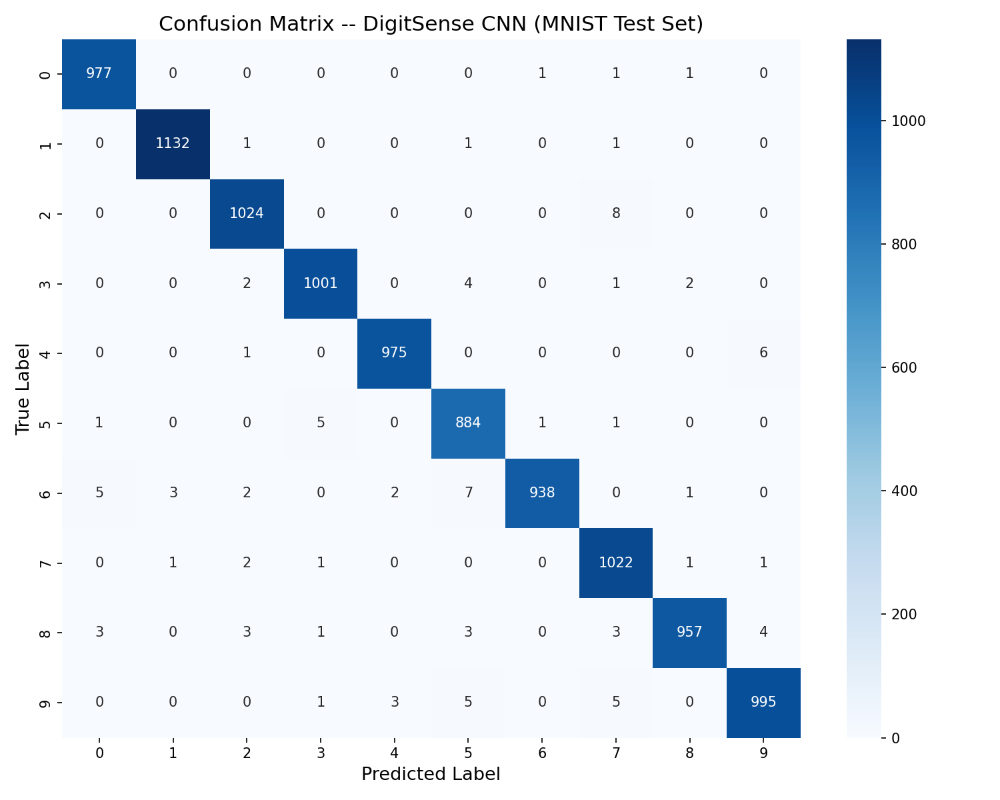
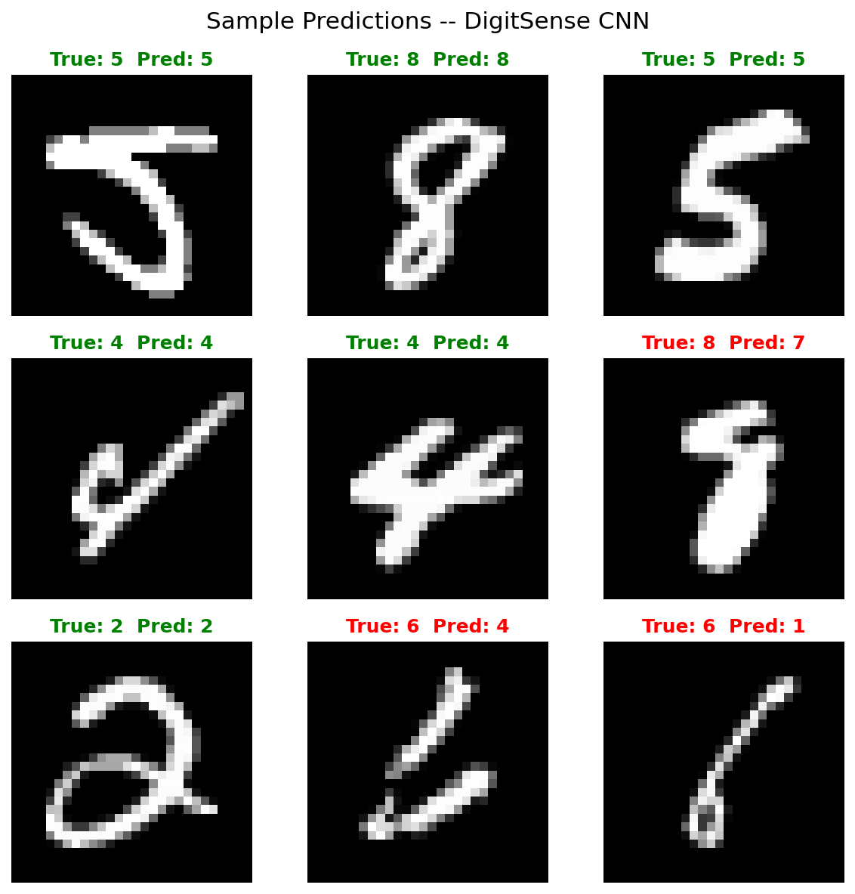

# DigitSense Project Report

## Objective
The objective of this project is to build an end-to-end, working, and robust handwritten digit recognition system using a Convolutional Neural Network (CNN). The project includes model training, performance evaluation, an interactive web application for real-time predictions, and a comprehensive preprocessing pipeline designed to handle real-world user image uploads.

## Tools & Tech
- **Core Language:** Python 3.10
- **Deep Learning Framework:** TensorFlow / Keras 3.12.4
- **Data Manipulation:** NumPy 2.2.6
- **Image Processing:** Pillow 12.1.0
- **Web App:** Streamlit 1.60.0
- **Evaluation & Visualization:** Scikit-learn 1.7.2, Matplotlib 3.10.8, Seaborn 0.13.2

## Dataset Description
The model is trained on the classic **MNIST dataset**, which contains:
- **60,000** training images
- **10,000** test images
- Format: 28x28 pixel grayscale images of handwritten digits (0 through 9).

## Methodology
The core of DigitSense is a Convolutional Neural Network (CNN), a type of deep learning model specifically designed to excel at computer vision tasks. The CNN uses "convolutional layers" to automatically scan the image and detect spatial patterns, learning simple features like edges and curves early on, and combining them into complex shapes (like loops or crossed lines) in deeper layers. Max-pooling layers then compress the image to retain only the most important features, reducing computation and preventing overfitting. Finally, dense layers act as the decision-making unit, interpreting these extracted features and outputting the probabilities for each of the 10 possible digit classes.

## Results
The CNN model achieved excellent performance on the held-out test set of 10,000 MNIST images.

| Metric | Score (Macro-Averaged) |
|--------|------------------------|
| **Accuracy** | 99.13% |
| **Precision** | 99.11% |
| **Recall** | 99.13% |
| **F1 Score** | 99.12% |

### Training Curves

### Confusion Matrix

### Sample Predictions

## Conclusion & Limitations

### Most Confused Digits
Although the model achieves over 99% accuracy, the confusion matrix highlights a few specific digit pairs that the model struggles to differentiate due to handwriting similarities. The top 5 most-confused pairs (True -> Predicted) are:
- **9 -> 5** (8 misclassifications)
- **6 -> 5** (7 misclassifications)
- **9 -> 4** (6 misclassifications)
- **4 -> 6** (6 misclassifications)
- **2 -> 7** (5 misclassifications)

### Limitations & Preprocessing Efficacy
To improve real-world usability, this project includes a robust preprocessing pipeline (`src/utils.py`) that converts inputs to grayscale, automatically inverts light backgrounds, finds the bounding box of the digit, and resizes/centers it to perfectly mimic the MNIST format (a 20px digit centered on a 28x28 black canvas). 

However, several limitations remain:
1. **Extremely messy, multi-digit, or very low-contrast images** may still be misclassified, as the bounding-box cropping assumes a single distinct subject.
2. **Font/Printed Styles vs. Handwriting:** During verification, a non-MNIST test image of the digit "7" was generated using a standard computer font (`arial.ttf`). While the inversion and centering pipeline preprocessed the image perfectly, the model incorrectly predicted it as a "2" (51.6% confidence). This explicitly demonstrates that the model is highly optimized for human handwriting distributions and can fail when presented with rigid, printed-style typography that falls outside its training domain.

## How to Run

1. **Install requirements:**
   `pip install -r requirements.txt`
2. **Train the model:**
   `python src/train.py`
3. **Run CLI prediction:**
   `python src/predict.py results/sample_digit_0.png`
4. **Launch Web App:**
   `streamlit run app.py`
